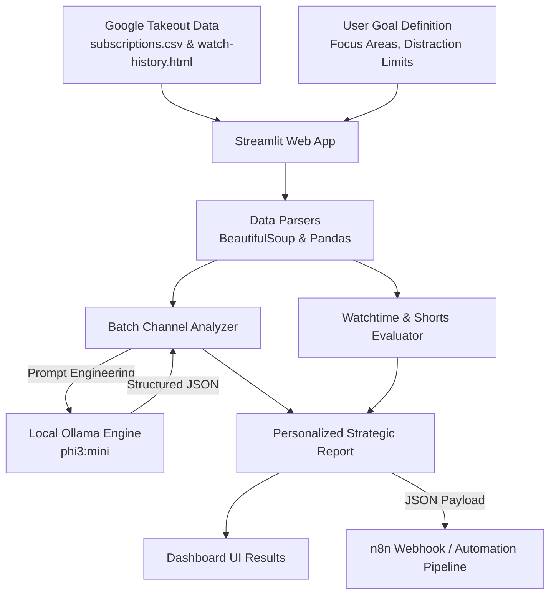

# 🧠 AboveInfluence

> **Goal-Based YouTube Influence Intelligence Engine**  
> *Audit your digital diet, reclaim your attention, and align your content consumption with who you want to become.*

[](https://python.org)
[](https://streamlit.io)
[](https://ollama.ai)
[](https://n8n.io)
[](LICENSE)

---

## 💡 Overview

Modern social algorithms optimize for maximum watch time and dopamine loops—often pulling us away from our real aspirations. **AboveInfluence** flips the script by acting as your personal content consumption auditor. 

By analyzing your **Google Takeout** YouTube data (subscriptions and watch history) against your self-defined career and lifestyle goals, AboveInfluence uses local AI (via **Ollama**) to evaluate which channels propel you forward and which act as cognitive liabilities.

---

## ✨ Key Features

- **🎯 Goal-Driven Intelligence**: Define your target identity (e.g. *Founding Engineer*, *Data Scientist*), focus areas, daily hours available, distraction sensitivity, and specific topics to avoid.
- **📂 Google Takeout Data Parsing**:
  - Automatically parses `subscriptions.csv` to catalog your creator ecosystem.
  - Extracts and analyzes watch history from `watch-history.html`.
- **🤖 Local AI Channel Audit (`phi3:mini`)**:
  - Batch processes channels to prevent context exhaustion.
  - Extracts category, goal alignment (*High / Medium / Low*), risk factor, identified influence tactics, and explicit unsubscribe recommendations.
  - Computes an **Influence Score** (0–100) per creator.
- **⏱ Shorts vs. Long-Form Analytics**:
  - Distinguishes high-friction educational long-form videos from dopamine-heavy Shorts.
  - Computes total estimated watch minutes and Shorts consumption percentage.
- **📊 Strategic Alignment Report**:
  - **Goal Alignment Score (0–100)**.
  - **Top 5 Channels Helping You** vs. **Top 5 Channels Harming Your Goals**.
  - Risk summary and personalized time-optimization advice.
- **⚡ n8n Webhook Integration**:
  - Automatically dispatches audit payloads to **n8n** workflows for recurring notifications, accountability digests, or database syncing.
- **🔒 Privacy First**:
  - Subscriptions and watch history are processed locally on your machine using Ollama without sending raw history to third-party proprietary LLM APIs.

---

## 🏗 System Architecture



---

## 🛠 Tech Stack

| Component | Technology | Purpose |
| :--- | :--- | :--- |
| **Frontend UI** | [Streamlit](https://streamlit.io/) | Interactive dashboard and file upload interface |
| **Local LLM Engine** | [Ollama](https://ollama.com/) (`phi3:mini`) | Offline, privacy-conscious reasoning and structured evaluation |
| **Data Extraction** | [BeautifulSoup4](https://www.crummy.com/software/BeautifulSoup/) + [lxml](https://lxml.de/) | HTML parsing of YouTube watch history |
| **Data Processing** | [Pandas](https://pandas.pydata.org/) | Batching, filtering, and metric aggregations |
| **Workflow Automation** | [n8n](https://n8n.io/) | Webhook dispatch for alerts and downstream actions |

---

## 🚀 Getting Started

### 1. Prerequisites

- **Python**: Version 3.10 or higher
- **Ollama**: Installed and running on your system ([Download Ollama](https://ollama.ai/download))

Pull the lightweight reasoning model:
```bash
ollama pull phi3:mini
```

### 2. Clone the Repository

```bash
git clone https://github.com/thejazz04/AboveInfluence.git
cd AboveInfluence
```

### 3. Install Dependencies

It is recommended to use a virtual environment:

```bash
# Windows
python -m venv .venv
.venv\Scripts\activate

# Linux / macOS
python3 -m venv .venv
source .venv/bin/activate
```

Install requirements:
```bash
pip install -r requirements.txt
```

### 4. Exporting Your YouTube Takeout Data

1. Navigate to [Google Takeout](https://takeout.google.com/).
2. Deselect all services and select only **YouTube and YouTube Music**.
3. Under *Multiple formats*, ensure:
   - **history**: HTML
   - **subscriptions**: CSV
4. Create the export and download the resulting `.zip` archive.
5. Extract the files:
   - `subscriptions.csv` is typically located under `YouTube and YouTube Music/subscriptions/subscriptions.csv`
   - `watch-history.html` is typically located under `YouTube and YouTube Music/history/watch-history.html`

### 5. Running the Application

Launch the Streamlit app:
```bash
streamlit run app.py
```

Open your browser at `http://localhost:8501`.

---

## ⚙️ Configuration

In [`app.py`](app.py), you can customize:

- **n8n Webhook**: Update `WEBHOOK_URL` to point to your self-hosted or cloud n8n webhook:
  ```python
  WEBHOOK_URL = "https://your-n8n-instance.com/webhook/analyze-influence"
  ```
- **Ollama Model**: If you have higher VRAM or prefer another model (e.g. `llama3:8b`, `mistral`, `qwen2.5:7b`), modify:
  ```python
  response = ollama.chat(
      model="phi3:mini",  # or "llama3:8b"
      messages=[{"role": "user", "content": prompt}]
  )
  ```
- **Batch Size**: Adjust batch sizes in `analyze_all_channels()` (default is 6 channels per LLM call).

---

## 🔒 Security & Privacy

Your YouTube viewing history and channel subscriptions reflect your personal life and interests.
- All AI processing executes **locally** using Ollama.
- No history data is sent to external AI providers.
- If you use the optional n8n webhook, ensure your endpoint is secure.
- Takeout data is excluded from version control via `.gitignore`.

---

## 🤝 Contributing

Contributions, feature requests, and suggestions are welcome!

1. Fork the Project
2. Create your Feature Branch (`git checkout -b feature/AmazingFeature`)
3. Commit your Changes (`git commit -m 'Add some AmazingFeature'`)
4. Push to the Branch (`git push origin feature/AmazingFeature`)
5. Open a Pull Request

---

## 📄 License

Distributed under the MIT License. See `LICENSE` for more information.
